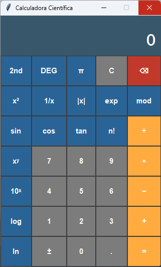

# Calculadora Científica em Python

Aplicação desktop de calculadora científica desenvolvida com Python e a biblioteca Tkinter.

## 🚀 Funcionalidades
- Operações básicas (+, -, *, /)
- Funções científicas (seno, cosseno, tangente, logaritmos, raiz quadrada)
- Suporte aos modos DEG e RAD
- Suporte a entrada pelo teclado físico

## 🛠️ Tecnologias
- Python 3
- Tkinter (GUI nativa)
  
- ## 📸 Interface



## ▶️ Como executar

### 1. Clone o repositório

```bash
git clone https://github.com/gwilhrm/calculadora-cientifica-python.git

---

## 🎓 Contexto Acadêmico e Créditos

- **Instituição:** Universidade Cidade de S. Paulo (UNICID)
- **Curso:** Engenharia de Software (1º Semestre)
- **Disciplina:** Programação de computadores
- **Orientador:** Prof. Me. Celso Cândido
- **Ferramentas de Apoio:** Utilização de Inteligência Artificial para auxílio na estruturação de arquitetura, refatoração de código, tratamento de exceções e documentação técnica.
